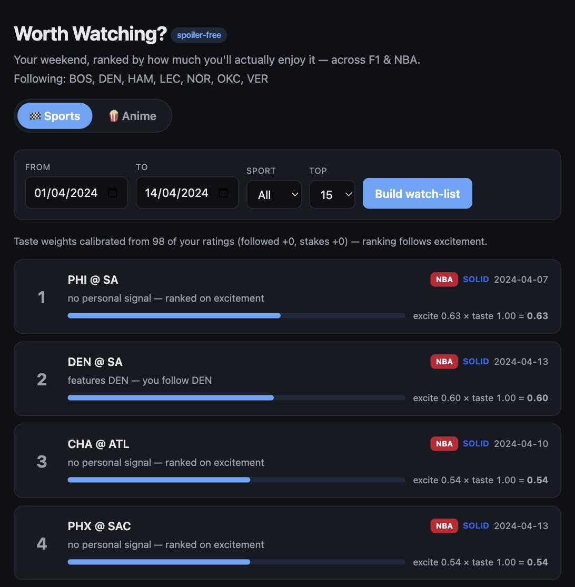
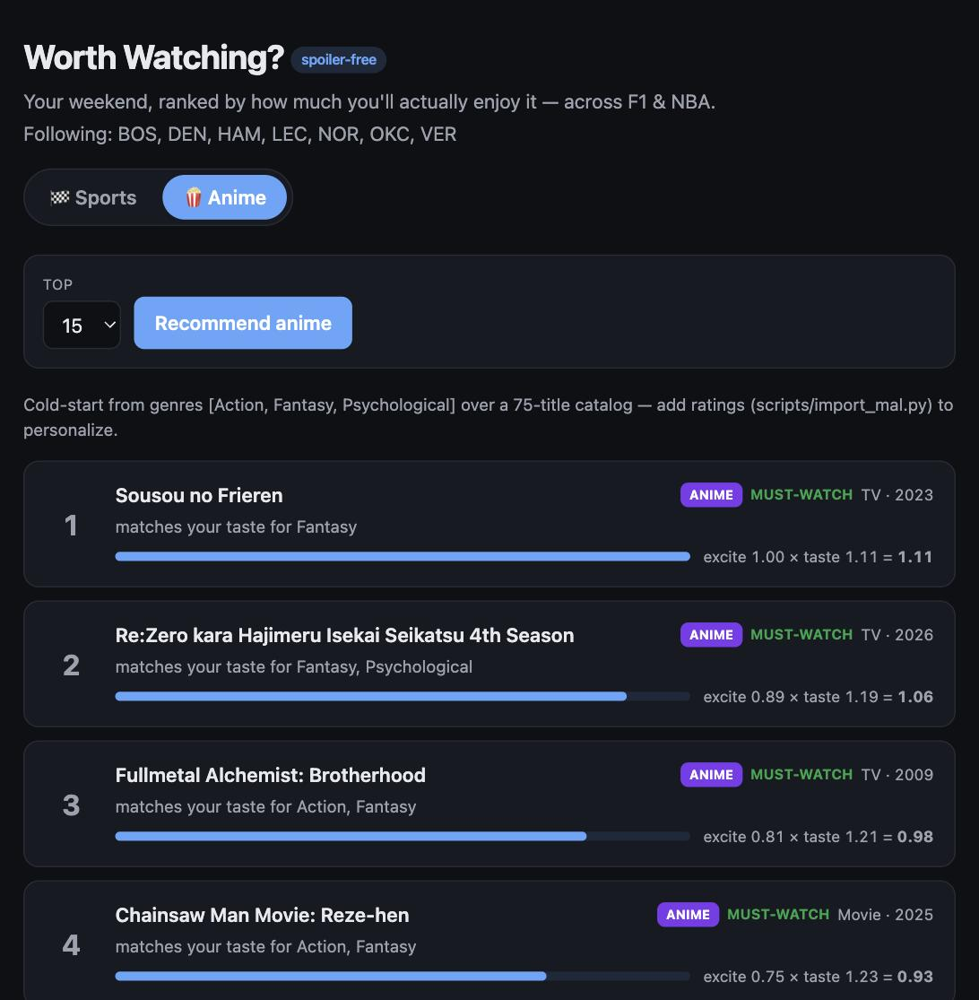

# Worth Watching?

**▶ Live demo: https://anikesh-99.github.io/worth-watching/**

A personalized recommendation **platform** that answers, spoiler-free:
*"What's actually worth my time tonight?"* — across live sport (F1, NBA, Premier
League, Champions League), anime, books, and music, with an **Upcoming** view
for events that haven't happened yet.

The public demo is a **Netflix-style** home screen (billboard + reason-labeled
shelves + "% match") with real cover art and matchup crests.

> The live demo is a static build (`web_static/`): the real Python pipeline's
> scores are precomputed into JSON, and the browser only filters and ranks. It
> runs with the default taste prior / cold-start (no personal ratings shipped);
> run the FastAPI app locally (`make serve`) for the full, ratings-calibrated
> experience.

Two very different recommendation engines sit behind **one `Recommender`
interface**: a sports **excitement** ranker (F1 + NBA + soccer) and a
**content-based** media ranker (anime + books + music, sharing one
`ContentRecommender`). A sports match, an unwatched anime, and an unread book are
the same problem shape — score an item's personalized worth-your-time-ness, then
rank a candidate set — which is what makes this a platform rather than scripts.

### Upcoming events, and an honest finding

For events that haven't happened, there's no box score, so excitement must be
**predicted** from pre-game features. Built and evaluated with a temporal split
(a test proves no lookahead), the result was a clean negative: pre-game signals
barely predict realized excitement (NBA Spearman ≈ 0.02) — sports drama is
high-variance and largely unforeseeable. So the **Upcoming** view doesn't fake a
thriller-predictor; it ranks by a transparent **watchability index** (stakes +
matchup pedigree + competitiveness) × personalization, honestly. The learned
predictor stays in the repo as the documented artifact.

## Architecture

```
                      ┌─────────────────────────────┐
                      │  Recommender (Protocol)      │
                      │  generate_candidates → score │
                      │  → rank                      │
                      └───────────────┬─────────────┘
              ┌───────────────────────┼────────────────────────┐
       SportRecommender                    ContentRecommender (Anime · Books)
   excitement × personalization                content quality × taste match
        │           │                                 │         │
   ExcitementIndex  calibrate(ratings)         subject/genre   rating-weighted
   + LightGBM       (evidence-based)           tag vectors     taste profile
        │                                            │
   FastF1 (F1) · ESPN (NBA)             Jikan (anime) · Open Library (books)
        └──────────────┬─────────────────────────────┘
             shared: evaluation harness (temporal split · NDCG · MAP · Spearman
                     · MMR diversity re-rank)
                       UserProfile · Item · Scored · FastAPI dashboard
```

See [the design doc](docs/design.md) for the full plan.

## Dashboard

One UI, three modes. **Sports** ranks a date-window watch-list by excitement ×
your calibrated taste; **Anime** and **Books** switch to content-based
recommendations — same cards, same spoiler-free reasons, different engine.

| Sports watch-list | Anime recommendations |
|---|---|
|  |  |

## Why this design is interesting

There is no free "I enjoyed this game" label. So the system separates two
models:

- an **objective excitement model** — labels come free from the box score
  (final margin, position changes, DNFs, stakes) and generalize across users;
- a thin **personalization layer** — your followed drivers/teams and a small
  set of your own ratings.

Ranking is framed as **learning-to-rank** and evaluated with a **temporal
split** (train on past seasons, test on the latest) — never a random split.

## Status

**Phase 1 — data foundation (done): two sport verticals, one tidy schema.**
- **F1** via [FastF1](https://docs.fastf1.dev/) (keyless, cached) → one row
  per race: DNFs, winner margin, positions moved, biggest climb.
- **NBA** via ESPN's keyless scoreboard → one row per game: final margin,
  overtime, lead changes, come-from-behind, all from per-quarter linescores.

NBA (~1,300 games/season) supplies the training volume F1's ~24 races/year
can't, and proves the ingest contract generalizes across sports.

**Phase 2 — shared excitement model (done).** One normalization layer maps
both sports onto a shared feature vocabulary (`competitiveness`, `volatility`,
`comeback`, `chaos`, `upset`, `stakes`), and a single LightGBM LambdaRank model
ranks across all 4,261 events. Evaluated with a temporal split (train ≤2023,
test 2024).

Honest result: the model is bootstrapped on a transparent weighted **index**
(no human ratings yet), so its ~1.0 agreement with that index is expected, not
a quality claim. The meaningful, non-circular finding is on NBA (large ranking
queries): naive chronological NDCG@10 **0.56** → single-feature **0.92**,
i.e. multi-signal ranking clearly helps. F1's per-month queries are too small
(1-3 races) for reliable NDCG. Cross-sport feature importance is dominated by
`competitiveness`, then `volatility`/`comeback`. Real quality evaluation
arrives in Phase 4 against the user's own ratings.

**Phase 3 — recommender + spoiler-free watch-list (done).** The two-stage
`Recommender` (candidate generation → excitement × personalization → rank) runs
across both sports in one ranked list. Personalization boosts followed teams
and high-stakes games; **reasons are spoiler-free** (they name the matchup,
the followed team, and playoff status — never the result). A placeholder
`data/my_ratings.csv` is seeded so it runs today; replace it with your own 1-5
ratings and personalization/eval use them immediately.

**Phase 4 — evaluation against real ratings (done).** `scripts/evaluate.py`
measures every ranker against 98 of the author's own 1-5 ratings (24 F1 + 74
NBA) and **auto-generates [`docs/evaluation.md`](docs/evaluation.md)** — the
table below is emitted, never hand-transcribed. Metrics: Spearman (overall),
NDCG@10 and MAP@10 per sport (gain = your rating).

| ranker | Spearman | NDCG@10 nba | MAP@10 nba |
|---|---|---|---|
| chronological (naive) | 0.18 | 0.64 | 0.35 |
| popularity / marquee | **−0.24** | 0.44 | 0.20 |
| competitiveness only | 0.65 | 0.90 | 0.91 |
| **excitement index** | **0.67** | 0.90 | 0.96 |
| personalized (assumed boosts) | 0.65 | 0.90 | 0.95 |
| personalized (per-sport calibrated) | 0.67 | 0.90 | 0.96 |
| Ridge / GBM on your ratings (OOF) | 0.64 / 0.63 | 0.91 / 0.97 | 1.0 / 1.0 |

Three findings, all kept honestly:
- **Baselines are genuinely beaten, not strawmen.** Popularity/marquee ordering
  *anti*-correlates with enjoyment (Spearman −0.24) — the author doesn't rate on
  star teams — so the index's 0.67 clears a real bar, not just chronological.
- **Core hypothesis validated:** objective box-score excitement predicts real
  enjoyment (0.67); a small model trained on the ratings does *not* beat the
  transparent index at n=98 (so we ship the index — the honest call).
- **Personalization refuted for this user, then fixed with evidence:** followed
  teams averaged 3.0 vs 3.4 and stakes correlated −0.22 with ratings, so the
  assumed "+35% for your team" boost *hurt* (0.67 → 0.65). `calibrate_per_sport()`
  learns the boosts *per sport* and clamps refuted signals to zero — recovering
  0.67. Because it's per-sport, soccer (which the author hasn't rated) keeps the
  neutral prior and still boosts followed clubs, instead of inheriting the
  NBA/F1 "team loyalty doesn't predict enjoyment" verdict.

**Beyond accuracy.** A watch-list that's five games of one team is accurate and
useless, so ranking is not the whole objective. Stage 3 offers an **MMR
re-rank** (`src/core/rerank.py`) that trades relevance for intra-list diversity
via one knob λ. The tradeoff is near-free here — lowering λ lifts diversity
**0.63 → 0.77 (+22%)** for a **0.1% NDCG** cost:

| λ | NDCG@10 | diversity@10 |
|---|---|---|
| 1.0 (pure relevance) | 0.968 | 0.63 |
| 0.6 | 0.967 | 0.76 |
| 0.4 | 0.967 | 0.77 |

**Phase 5 — FastAPI backend + web dashboard (done).** A self-contained page
(no external assets) served by FastAPI shows the spoiler-free watch-list for any
date window, with a sport filter and a per-event `excite × taste = score`
breakdown. The calibration banner surfaces the Phase 4 finding to the viewer.
A **Sports / Anime mode toggle** unifies both verticals in one UI — the same
card renderer shows a sports watch-list or content-based anime recommendations.
API: `GET /api/meta`, `GET /api/watchlist?start=&end=&sport=&top=`,
`GET /api/anime?top=`.

**Phase 6 — media verticals (anime + books) on the same interface (done).**
The payoff of Phase 1's abstraction: one `ContentRecommender` implements the
exact same `Recommender` protocol as sports, but the engine is completely
different — **content-based taste matching** instead of excitement.
`AnimeRecommender` and `BookRecommender` are thin subclasses (genres/themes vs
subjects). Catalogs via Jikan (anime) and Open Library (books), both keyless.
Mirrors the sports split: `excitement` = community quality prior,
`personalization` = cosine of your rating-weighted tag profile, reasons name the
genres/subjects you like (never plot). Ratings come from a Goodreads CSV export
(`scripts/import_goodreads.py`) / MAL export / a template; the shared harness
evaluates both. **Different scoring engines, one interface — the platform claim,
proven across three domains.**

```bash
python -m venv .venv && ./.venv/bin/pip install -r requirements.txt
./.venv/bin/python scripts/build_dataset.py configs/f1.yaml    # sports data
./.venv/bin/python scripts/build_dataset.py configs/nba.yaml
./.venv/bin/python scripts/build_dataset.py configs/anime.yaml # anime catalog (Jikan)
./.venv/bin/python scripts/build_dataset.py configs/books.yaml # book catalog (Open Library)
./.venv/bin/python scripts/train_excitement.py                 # shared model + temporal eval
./.venv/bin/python scripts/evaluate.py                         # sports: eval vs your ratings
./.venv/bin/python scripts/recommend_anime.py                  # anime recommendations
./.venv/bin/python scripts/recommend_books.py                  # book recommendations
./.venv/bin/python scripts/serve.py                            # dashboard -> http://127.0.0.1:8000
./.venv/bin/python -m pytest -q                                 # 72 tests, network-free + cached
```

**Music (Spotify) vertical.** A fourth `ContentRecommender`: taste = your top
artists' genres, candidates = discovered artists in those genres + your top
artists' recent releases. Honest constraint story — Spotify's restricted app
tier returns *no* artist genres and blocks recommendations/related-artists/
browse/batch endpoints (search caps at 10), so genres are recovered from
**MusicBrainz** and candidates assembled from the endpoints that still work. In
the local dashboard as a 🎵 Music mode; kept off the public demo since its
catalog is built from personal taste (the demo ships no personal data).

**Embedding retrieval (two-stage) for media.** The media verticals get an
explicit **retrieve → rank** split. A dense **embedding tower** (TruncatedSVD /
LSA over the tag matrix, `src/media/embeddings.py`) compresses each item into a
latent space where correlated genres share factors; the taste vector projects
into the *same* space. A **nearest-neighbour retriever** (`src/media/retrieval.py`)
then does stage-1 candidate generation, with two backends — exact cosine and a
from-scratch **random-hyperplane LSH** — so the accuracy/speed tradeoff is real,
not hand-waved. Evaluated in **[`docs/retrieval.md`](docs/retrieval.md)**:

- **Embedding fidelity** — dim-32 embeddings recover the exact taste neighbour
  set (recall@10 → 1.0 by K≈20-40 across anime/books/music): the compression
  keeps the signal.
- **LSH recall** traces the textbook ANN curve — e.g. books **0.3 → 0.5 → 0.9**
  as hyperplanes go 8 → 16 → 32 (a bigger catalog needs finer buckets).

Honest scale note: at N < 1k exact retrieval is instant and *correct*, so it's
the default. The value here is the two-tower seam and the proof that embedding
retrieval preserves quality — the drop-in point for a sharded ANN service at
10M items. (The current ranker is quality-dominated, so embeddings serve
taste-based discovery and *similar-items*, not pruning a quality-sorted list.)

All six phases complete, four verticals live.

## At scale (what I'd build next, and why it isn't here)

This is a single-user batch system by design; the interesting question is what
changes when it isn't. Called out explicitly because knowing the gap is the
point:

- **Retrieval, not full-scan.** Sports candidate generation is still a
  date-window scan (fine for ~24 races/season). The media verticals already have
  the **two-stage embedding retriever** (see *Embedding retrieval* above); the
  scale step is swapping the from-scratch LSH for a production ANN index
  (faiss/hnsw) behind the same interface, and giving sports the same treatment.
- **Online/offline consistency.** The one real production hazard I've guarded
  against in miniature: upcoming `stakes` reuses the *exact* formula the history
  uses, so a match doesn't change "importance" the moment it finishes. At scale
  that discipline needs a **feature store** with a shared transform, not
  convention.
- **Exploration.** The owner-rating loop is pure exploit. A **contextual bandit
  (Thompson sampling)** would surface uncertain items to learn taste faster —
  the natural next experiment given the feedback loop already exists.
- **Monitoring.** With a daily cron and live calibration, I'd track
  **calibration drift and metric-over-time**, not just a one-shot eval.

The judgment call the whole repo makes: prefer the transparent index the learned
model can't beat at this N, and add complexity only when the evaluation earns it.

## Layout

```
src/core/interfaces.py     # Recommender protocol shared by every vertical
src/core/features.py       # per-sport -> unified excitement feature vocabulary
src/core/excitement.py     # transparent index + shared LightGBM LambdaRank model
src/core/evaluation.py     # temporal split + NDCG / MAP / MRR / Spearman / diversity
src/core/rerank.py         # MMR diversity re-rank (stage-3 relevance↔diversity knob)
src/core/profile.py        # load followed entities + ratings -> UserProfile
src/sports/ingest.py       # F1: FastF1 -> tidy per-race dataframe
src/sports/nba_ingest.py   # NBA: ESPN scoreboard -> tidy per-game dataframe
src/sports/personalize.py  # spoiler-free taste multiplier + reasons
src/sports/recommender.py  # SportRecommender: the two-stage Recommender
configs/{f1,nba}.yaml      # sport-specific config (seasons, followed entities)
scripts/build_dataset.py   # dispatches on config `vertical`
scripts/train_excitement.py# trains + evaluates the shared model
scripts/make_ratings_template.py # human-readable ratings template to fill
scripts/evaluate.py        # eval every ranker vs your ratings -> docs/evaluation.md
scripts/evaluate_retrieval.py # media embedding-retrieval eval -> docs/retrieval.md
scripts/watchlist.py       # end-to-end spoiler-free watch-list (CLI)
src/media/content.py       # ContentRecommender: shared content-based engine
src/media/embeddings.py    # dense item embedding tower (TruncatedSVD / LSA)
src/media/retrieval.py     # nearest-neighbour retriever (exact + from-scratch LSH)
src/media/anime_ingest.py  # anime: Jikan catalog -> tidy content table
src/media/recommender.py   # AnimeRecommender (thin subclass)
src/media/book_ingest.py   # books: Open Library catalog -> tidy content table
src/media/book_recommender.py # BookRecommender (thin subclass)
src/serving/service.py     # loads data + calibrated weights, answers queries
src/serving/app.py         # FastAPI: /api/meta, /api/watchlist, /api/media
web/index.html             # self-contained 3-mode dashboard (no external assets)
scripts/serve.py           # launch the dashboard
scripts/recommend_{anime,books}.py # media recs; import_{mal,goodreads}.py import lists
scripts/build_static.py    # bake scores -> web_static/ for GitHub Pages
tests/                     # 72 tests across sports + media verticals
```
